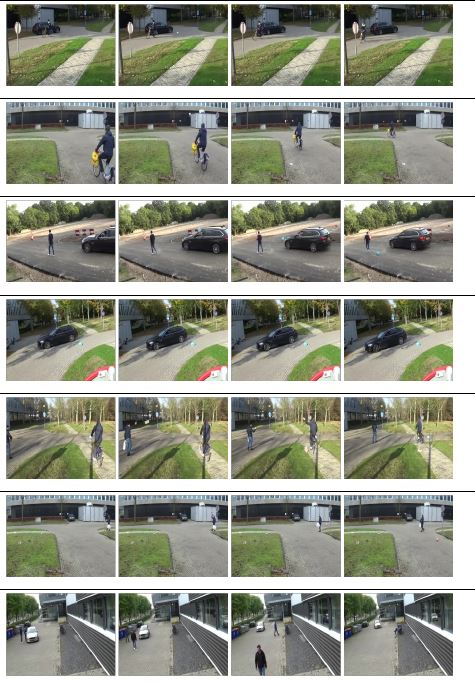

# Throwing-Action
### Throwing Action dataset
We generated Throwing Action dataset including following six categories for generic anomaly detection model. 

* Bicycle Safe
* Bicycle Dangerous
* Car Safe
* Car Dangerous
* Pedestrian Safe
* Pedestrian Dangerous

Overall, the generated dataset consists of 130 normal videos without throwing anomalies and 271 anomalous videos divided over all six anomaly classes. 
All videos have a resolution of 320x240 pixels which is compatible with well-known UCF-Crime dataset. One of the challenges in our dataset is that throwing anomaly videos can contain multiple throwing actions up to a maximum of ten. 

At this moment, complete dataset is not available yet because of the data privacy process. Please contact us to be able to reach the dataset. 

